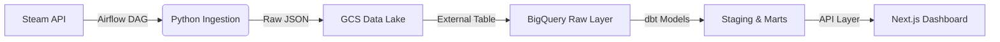

# 🎮 SteamPulse: End-to-End Data Engineering Platform

**SteamPulse** is a full-stack data engineering project designed to analyze market dynamics for over 10,000+ games on the Steam store.

It implements a robust ELT (Extract, Load, Transform) pipeline to process data in reliable batches. A custom Python ingestion engine fetches and validates raw game metadata into a Google Cloud Storage Data Lake. This raw data is then loaded into BigQuery and transformed into analytical marts using dbt, ensuring schema consistency and data quality before reaching the Next.js dashboard.

The platform serves real-time insights—such as "Hype Scores" and "Publisher Consistency"—bridging the gap between raw unstructured JSON and actionable business intelligence.

---

## 📸 Demo


https://github.com/user-attachments/assets/fe8cbbd2-7be4-4b37-810d-6ae17ea67099


---

## 🏗️ Architecture

The system follows a modern **Lakehouse Architecture** automated via Airflow DAGs:



1. **Orchestration (Airflow):** A daily DAG triggers the ingestion script, waits for completion, and then triggers the dbt transformation runner.
2. **Ingestion (Python):** Custom script handles rate limits, fetches game metadata, and uploads batches to **Google Cloud Storage (GCS)**.
3. **Storage (BigQuery):** Data is loaded into BigQuery via External Tables, separating compute from storage costs.
4. **Transformation (dbt):**
* **Staging:** Cleans raw JSON, handles type-casting (`SAFE_CAST`), and deduplicates records.
* **Marts:** Aggregates business logic (e.g., "Hype Score," "Publisher Reliability").


5. **Visualization (Next.js):** A server-side rendered dashboard visualizes trends using Recharts and TanStack Table.

---

## 🧠 Data Modeling & Transformation (dbt)

The core business logic and data quality tests are handled by **dbt (data build tool)**. You can explore the full SQL logic and lineage in the dedicated repository.

👉 **[View the dbt Repository / Models](https://github.com/deceasedone/steampulse-dbt)**

**Key Models:**

* `stg_games`: Flattens nested JSON arrays (Genres, Developers) and handles currency conversion.
* `mart_hype_metrics`: Calculates "Review Velocity" to identify trending games relative to their release date.
* `mart_publisher_stats`: Aggregates historical performance data to rank publishers by consistency (Standard Deviation of Ratings).

---

## 🚀 Key Features

### 🌪️ Data Pipeline (Backend)

* **Automated Workflows:** Airflow DAGs ensure data freshness and handle retry logic for API failures.
* **Resilient Ingestion:** "Repair" scripts automatically fix malformed JSON batches before loading to the Data Lake.
* **Quality Assurance:** dbt tests ensure primary keys are unique and prices are non-negative before data hits the dashboard.

### 📊 Analytics Dashboard (Frontend)

* **🔥 Hype Tracker:** A custom algorithm calculates "Review Velocity" (reviews/day) to identify viral hits like *Palworld* or *Black Myth: Wukong*.
* **🏆 Publisher Leaderboard:** Categorizes studios into "Quality First" vs. "Asset Flippers" based on catalog consistency and ratings.
* **📈 Genre Trends:** Analyzes price-to-rating correlation across 20+ genres.
* **⚡ High Performance:** Uses Next.js Server Components for sub-second page loads directly from BigQuery.

---

## 🛠️ Tech Stack

### Data Engineering

* **Orchestration:** Apache Airflow
* **Transformation:** dbt Core (SQL, Jinja, YAML)
* **Warehouse:** Google BigQuery
* **Lake:** Google Cloud Storage (GCS)
* **Language:** Python 3.10

### Full Stack Web

* **Framework:** Next.js 14 (App Router)
* **Language:** TypeScript
* **Styling:** Tailwind CSS
* **Visualization:** Recharts
* **Deployment:** Vercel (Frontend), GCP (Backend)

---

## 📂 Project Structure

```bash
steampulse/
├── dags/                  # Airflow DAGs for scheduling
├── models/                # dbt models (The "T" in ELT)
│   ├── staging/           # raw -> clean (type casting, dedup)
│   └── marts/             # clean -> analytics (aggregations)
├── frontend/              # Next.js Application
│   ├── app/               # App Router & API Endpoints
│   ├── components/        # Recharts & UI Components
│   └── lib/               # BigQuery Client
├── scripts/               # Python Ingestion Logic
│   ├── ingest.py          # Steam API Crawler
│   └── repair.py          # JSON Validator
└── dbt_project.yml        # dbt Config

```

---

## ⚡ Getting Started

### 1. Backend Setup

```bash
# Clone the repository
git clone https://github.com/deceasedone/SteamPulse.git

# Install Python dependencies
pip install -r requirements.txt

# Run dbt transformations
dbt run

```

### 2. Frontend Setup

```bash
cd frontend

# Install dependencies
npm install

# Setup Environment Variables (GCP_CREDENTIALS)
# ...

# Run Development Server
npm run dev

```

Open `http://localhost:3000` to view the dashboard.


## 📜 License

Distributed under the MIT License. See `LICENSE` for more information.

---

**Built by Gaurav Sinha **
*Data Engineer | Full Stack Developer*
