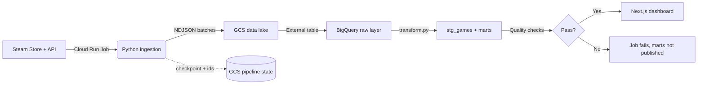

# 🎮 SteamPulse: End-to-End Data Engineering Platform

**SteamPulse** is a full-stack data platform that analyses market dynamics across ~10,000 games on the Steam store.

It implements an ELT pipeline: a Python ingestion engine scrapes and fetches raw game metadata into a Google Cloud Storage data lake as newline-delimited JSON, BigQuery reads that lake through an external table, and a transform step builds a deduplicated staging model plus analytical marts — validated by data-quality assertions before anything reaches the Next.js dashboard.

The platform surfaces insights such as **review velocity** ("hype") and **publisher consistency**, bridging raw unstructured JSON and actionable analytics.

---

## 📸 Demo

https://github.com/user-attachments/assets/fe8cbbd2-7be4-4b37-810d-6ae17ea67099

---

## 🏗️ Architecture


```mermaid
graph LR
    A[Steam Store + API] -->|Cloud Run Job| B(Python ingestion)
    B -->|NDJSON batches| C[GCS data lake]
    B -.->|checkpoint + ids| S[(GCS pipeline state)]
    C -->|External table| D[BigQuery raw layer]
    D -->|transform.py| E[stg_games + marts]
    E -->|Quality checks| F{Pass?}
    F -->|Yes| G[Next.js dashboard]
    F -->|No| H[Job fails, marts not published]
```

1. **Orchestration (Airflow):** the DAG runs the ingestion Cloud Run job, then — only on success — the transform job. It defaults to **weekly** (`STEAM_DAG_SCHEDULE`) to stay inside the GCP always-free tier; see [Running costs](#-running-costs).
2. **Ingestion (Python):** discovers app ids from the storefront, fetches metadata with retry/backoff, and uploads NDJSON batches to GCS. The checkpoint and discovered-id list are stored **in GCS**, so an execution on ephemeral compute resumes where the last one stopped rather than restarting from zero.
3. **Storage (BigQuery):** an external table over `gs://<bucket>/raw_layer/*` separates storage from compute.
4. **Transformation:** `transform.py` rebuilds `stg_games` (deduplicated to the newest snapshot per game), then `mart_trends` and `mart_publishers`.
5. **Quality gate:** uniqueness, null, range and row-count assertions run after every build. A failure raises, so the job fails loudly instead of publishing bad data.
6. **Visualisation (Next.js):** pages are React Server Components that query BigQuery directly and revalidate hourly.

> **Note on dbt:** the transformation logic in *this* repository is plain Python + BigQuery SQL (`transform.py`), including its own data-quality assertions. A parallel dbt implementation of the same models lives in **[steampulse-dbt](https://github.com/deceasedone/steampulse-dbt)**. The BigQuery dataset is named `dbt_gsinha` for historical reasons; the tables the dashboard reads are the ones `transform.py` builds.

---

## ☁️ Cloud prerequisites

| Resource | Purpose |
| --- | --- |
| Service account | `BigQuery Data Editor` + `BigQuery Job User` + `Storage Object Admin` |
| GCS bucket | Raw NDJSON batches (`raw_layer/`) and pipeline state (`pipeline_state/`) |
| BigQuery dataset | Raw external table + generated staging/mart tables |
| Cloud Run Jobs | `steam-ingest-job` and `steam-transform-job` |

---

## 💰 Running costs

The project is designed to sit inside the GCP **always-free** tier. Measured against this dataset (9,786 games, 2.1 MB staging table):

| Service | Usage | Free tier | Headroom |
| --- | --- | --- | --- |
| BigQuery storage | 2.1 MB | 10 GB/mo | 0.02% |
| BigQuery queries | ~40 MB per full site refresh | 1 TiB/mo | ~26,000 refreshes/mo |
| GCS storage | ~158 MB added per ingest run | 5 GB | see cadence below |
| Cloud Run Jobs | ~1.8 h (~6,400 vCPU-sec) per run | 180k vCPU-sec/mo | see cadence below |

**Ingestion cadence is the only real cost lever.** A full refresh re-fetches every app id, so cost scales linearly with how often it runs:

| Cadence | Cloud Run | GCS (90-day retention) | Verdict |
| --- | --- | --- | --- |
| Daily | 107% of free tier | 284% of free tier | ❌ over on both |
| Every 3 days | 36% | 95% | ⚠️ GCS at the edge |
| **Weekly (default)** | **15%** | **41%** | ✅ comfortable |

Override with `STEAM_DAG_SCHEDULE` (e.g. `0 3 */3 * *`).

**Hard guards worth setting once:**

* A [custom BigQuery quota](https://cloud.google.com/bigquery/docs/custom-quotas) (IAM & Admin → Quotas → "Query usage per day"). Unlike a budget alert, this makes queries *fail* rather than bill — set 20 GB/day and BigQuery cannot charge you.
* A GCS lifecycle rule to expire old raw batches, or the lake grows without bound.
* **Do not use Cloud Composer** for the DAG — managed Airflow has no free tier and starts around $300/month. The local `docker-compose` setup is the intended path.

The dashboard also caps every query with `maximumBytesBilled` and rate-limits its public API routes.

---

## 🚀 Key features

### Data pipeline

* **Resumable ingestion** — checkpoint state in GCS survives container restarts.
* **Honest rate-limit handling** — a `429` sleeps and retries *the same* app id instead of skipping it.
* **Observable failures** — network and parse errors are counted and logged; a run where >50% of fetches fail aborts rather than reporting success on an empty load.
* **Deterministic models** — dedup orders by ingestion time, and genre/publisher picks are explicitly ordered, so rebuilds are reproducible.
* **Quality gate** — primary-key uniqueness, non-negative prices, rating ranges and a minimum row count, enforced before marts are published.

### Dashboard

* **Hype tracker** — review velocity (reviews/day since launch) over a selectable window, bucketed by release age.
* **Publisher leaderboard** — ranks by *consistency* (standard deviation of Metacritic), not just average.
* **Genre trends** — catalogue size, pricing, and a price-versus-quality scatter.
* **Game explorer** — server-side filtering, sorting and pagination across the full catalogue with a debounced search.
* **Server-rendered** — pages fetch on the server and revalidate hourly; no client-side fetch waterfall.

---

## 🛠️ Tech stack

**Data:** Apache Airflow · Google BigQuery · Google Cloud Storage · Python 3.12 · Cloud Run Jobs
**Web:** Next.js 16 (App Router, RSC) · React 19 · TypeScript · Tailwind CSS v4 · Recharts · Vitest

---

## ⚡ Getting started

### 1. Configure

```bash
cp .env.example .env
```

Fill in `.env` — at minimum `GCP_PROJECT_ID` and `GCS_BUCKET`. Place a service-account key at `gcp_keys.json` (git-ignored), or set `GCP_CREDENTIALS` to the key's JSON contents.

### 2. Pipeline

```bash
pip install -r requirements.txt
```

Run a small ingestion smoke test:

```bash
python ingest.py --limit 20
```

Build the warehouse models and run the quality checks:

```bash
python transform.py
```

### 3. Dashboard

```bash
cd frontend && npm install && npm run dev
```

Open <http://localhost:3000>.

> The frontend needs credentials too: either `frontend/gcp_keys.json`, or `GCP_CREDENTIALS` in `frontend/.env.local`.

### 4. Local Airflow (optional)

Set `AIRFLOW_FERNET_KEY` and `AIRFLOW_ADMIN_PASSWORD` in `.env` first:

```bash
python -c "from cryptography.fernet import Fernet; print(Fernet.generate_key().decode())"
```

```bash
docker compose up
```

The UI is at <http://localhost:8081>.

---

## ✅ Tests

```bash
python -m pytest tests/ -q
```

```bash
cd frontend && npm run lint && npm run typecheck && npm test
```

Neither suite needs cloud credentials — the pipeline tests stub the network and assert on generated SQL, and the frontend tests mock the BigQuery client. CI runs both on every push, plus a secret scan that fails the build if a credential file is ever committed.

---

## 📁 Layout

```
config.py            Env-driven settings shared by every pipeline script
state_store.py       GCS-backed checkpoint/discovery state (local fallback)
ingest.py            Discovery + metadata fetch + NDJSON batch upload
transform.py         stg_games, marts, and the data-quality gate
fetch_list.py        Optional authenticated app-list fetch (needs STEAM_API_KEY)
scripts/repair_gcs.py One-off: convert legacy JSON-array batches to NDJSON
dags/steam_dag.py    Airflow DAG: ingest >> transform
tests/               Pipeline tests (no credentials required)
frontend/
  lib/               config, bigquery client, queries, rate limiter, types
  app/               App Router pages (RSC) + public API routes
  components/        UI and client chart islands
  tests/             Frontend unit tests
```

---

## 📜 License

Distributed under the MIT License. See `LICENSE`.

---

**Built by Gaurav Sinha** · *Data Engineer | Full Stack Developer*
